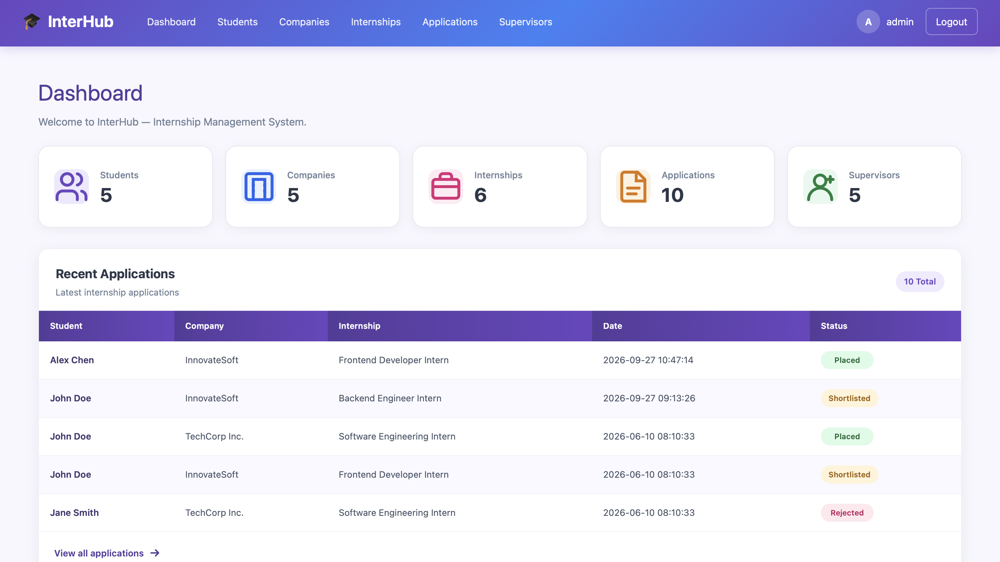
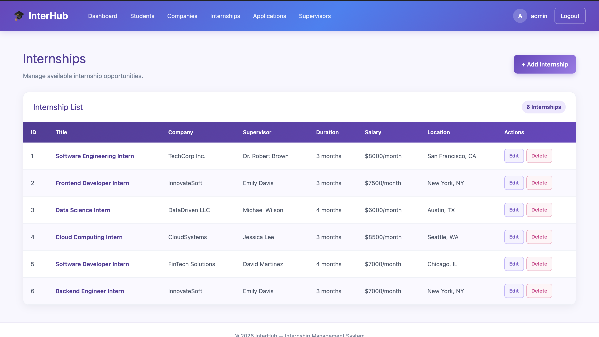
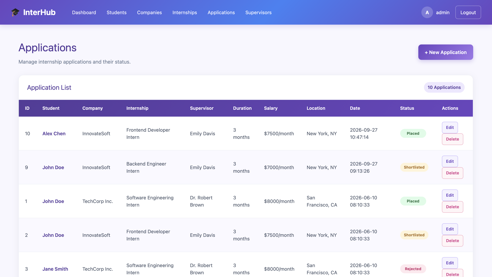
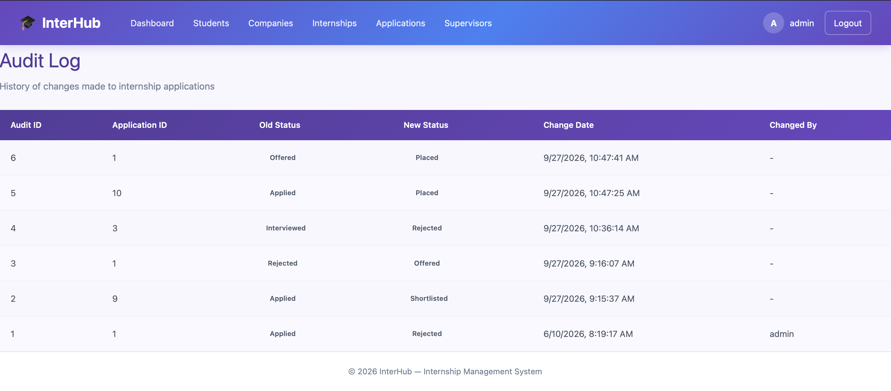

# InterHub — Internship Management System

A web-based internship management system for managing internship opportunities, students, companies, supervisors, and applications in one centralized platform.

InterHub is built with a **React frontend**, **Flask REST API**, and **SQLite database**, with authentication and role-based access control.

---

## Project Overview

InterHub is a full-stack web application developed as a Computer Science university project.

The system connects three main user roles:

- **Administrator** — manages students, companies, internships, supervisors, and applications.
- **Student** — views internships and submits applications.
- **Company** — manages company internships and updates application statuses.

The application uses authentication and backend-enforced role-based authorization to control access to different features.

---
## Screenshots

### Dashboard



### Internship Management



### Application Management



### Audit Log


## Key Features

### Authentication & Authorization

- Session-based authentication
- Role-based access control (RBAC)
- Separate permissions for Admin, Student, and Company users
- Protected API endpoints
- Backend permission enforcement

### Internship Management

- View available internships
- Create and manage internship opportunities
- Assign company supervisors
- Track internship title, duration, salary, location, company, and supervisor

### Application Management

- Submit internship applications
- View application records
- Update application status
- Track application progress
- View detailed application information

### Application Status Tracking

Applications can move through the following stages:

`Applied` → `Shortlisted` → `Interviewed` → `Offered` → `Placed`

Applications can also be marked as:

`Rejected`

### Application Details

A dedicated application details page provides information such as:

- Student information
- Company information
- Internship information
- Supervisor information
- Application date
- Current application status

### Audit Log

The system records application status changes, including:

- Application ID
- Previous status
- New status
- Change date
- User who made the change

### Dashboard

The dashboard provides:

- Statistics overview
- Recent applications
- Quick actions
- Application management shortcuts
- Role-aware system information

---

## User Roles & Permissions

| Feature | Admin | Student | Company |
|---|:---:|:---:|:---:|
| Dashboard | Yes | Yes | Yes |
| View Students | Yes | Yes | No |
| Manage Students | Yes | No | No |
| View Companies | Yes | No | Yes |
| Manage Companies | Yes | No | Yes |
| View Internships | Yes | Yes | Yes |
| Manage Internships | Yes | No | Yes |
| View Applications | Yes | Yes | Yes |
| Create Applications | Yes | Yes | No |
| Update Applications | Yes | No | Yes |
| Delete Applications | Yes | No | No |
| View Supervisors | Yes | No | Yes |
| Audit Log | Yes | No | No |

> Permissions are enforced on the backend as well as reflected in the frontend interface.

---

## Technology Stack

### Frontend

- React
- JavaScript
- CSS
- React Router
- Fetch API

### Backend

- Python
- Flask
- Flask-CORS
- Python-dotenv
- REST API

### Database

- SQLite

### Development Tools

- Visual Studio Code
- Git
- GitHub
- npm

---

## System Architecture

```text
┌───────────────────────────────┐
│        React Frontend         │
│                               │
│  Login                        │
│  Dashboard                    │
│  Students                     │
│  Companies                    │
│  Internships                  │
│  Applications                 │
│  Application Details          │
│  Audit Log                    │
│  Supervisors                  │
└───────────────┬───────────────┘
                │
                │ REST API
                ▼
┌───────────────────────────────┐
│        Flask Backend          │
│                               │
│  Authentication               │
│  Role-Based Authorization     │
│  Application Logic            │
│  API Endpoints                │
└───────────────┬───────────────┘
                │
                │ SQL
                ▼
┌───────────────────────────────┐
│          SQLite               │
│                               │
│  Student                      │
│  Company                      │
│  Internship                   │
│  Supervisor                   │
│  Application                  │
│  ApplicationAudit             │
└───────────────────────────────┘
```

---

## Project Structure

```text
Internship-Management-System/
│
├── backend/
│   ├── app.py
│   ├── db.py
│   ├── .env.example
│   └── .env
│
├── public/
│
├── src/
│   ├── App.js
│   ├── App.css
│   ├── api.js
│   ├── LoginPage.jsx
│   ├── Dashboard.jsx
│   ├── StudentsPage.jsx
│   ├── CompaniesPage.jsx
│   ├── InternshipsPage.jsx
│   ├── ApplicationsPage.jsx
│   ├── ApplicationDetailsPage.jsx
│   ├── AuditLogPage.jsx
│   └── SupervisorsPage.jsx
│
├── .gitignore
├── package.json
├── package-lock.json
└── README.md
```

---

## Database

The application uses **SQLite** as its database.

Main entities include:

- Student
- Company
- Internship
- Supervisor
- Application
- ApplicationAudit

The database location is configured through the `DATABASE_PATH` environment variable.

---

## Getting Started

### Prerequisites

Make sure you have the following installed:

- Node.js
- npm
- Python 3
- Git

### 1. Clone the Repository

```bash
git clone https://github.com/sanaeAbourouh/Internship-Management-System.git
cd Internship-Management-System
```

### 2. Install Frontend Dependencies

```bash
npm install
```

### 3. Configure Backend Environment

Create the backend `.env` file from the example:

```bash
cd backend
cp .env.example .env
```

Update the values in `.env` according to your local environment.

Example:

```env
DATABASE_PATH=/absolute/path/to/interhub.db
SECRET_KEY=your-secret-key

ADMIN_USERNAME=admin
ADMIN_PASSWORD=your-admin-password

STUDENT_USERNAME=student
STUDENT_PASSWORD=your-student-password

COMPANY_USERNAME=company
COMPANY_PASSWORD=your-company-password
```

> The `.env` file is intentionally excluded from Git.

### 4. Install Backend Dependencies

From the project root:

```bash
pip install flask flask-cors python-dotenv
```

### 5. Start the Flask Backend

From the project root:

```bash
python backend/app.py
```

The backend runs on:

```text
http://127.0.0.1:5000
```

### 6. Start the React Frontend

Open another terminal in the project root:

```bash
npm start
```

The frontend runs on:

```text
http://localhost:3000
```

---

## Demo Accounts

The application includes three local demonstration roles:

| Role | Username | Password |
|---|---|---|
| Administrator | `admin` | `admin123` |
| Student | `student` | `student123` |
| Company | `company` | `company123` |

> These credentials are intended for local demonstration purposes only.

---

## API Overview

The Flask backend provides REST API endpoints for:

| Endpoint | Purpose |
|---|---|
| `/api/login` | User authentication |
| `/api/logout` | User logout |
| `/api/students` | Student management |
| `/api/companies` | Company management |
| `/api/supervisors` | Supervisor management |
| `/api/internships` | Internship management |
| `/api/applications` | Application management |
| `/api/application-details` | Detailed application information |
| `/api/audit-log` | Application status history |

Authentication and authorization are applied to protected endpoints according to the user's role.

---

## Security

The project includes several basic security practices:

- Environment variables for configuration and secrets
- `.env` excluded from version control
- Session-based authentication
- Backend role-based authorization
- Protected API endpoints
- CORS configuration for local development
- SQLite foreign-key enforcement

> This project is intended for educational and portfolio purposes and is not a production-ready authentication system.

---

## Screenshots

The project interface includes:

- Login page
- Dashboard
- Student management
- Company management
- Internship management
- Application management
- Application details
- Audit log

Screenshots can be added here to demonstrate the application's interface.

---

## Future Improvements

Possible future improvements include:

- Password hashing and persistent user accounts
- More advanced authentication
- Email notifications
- Advanced internship search and filtering
- Application analytics
- Student and company profile pages
- CV and file uploads
- Cloud deployment
- Automated testing
- Production database such as PostgreSQL

---

## Author

**Sanae Abourouh**

Computer Science Student

---

## License

This project was developed for educational and portfolio purposes.